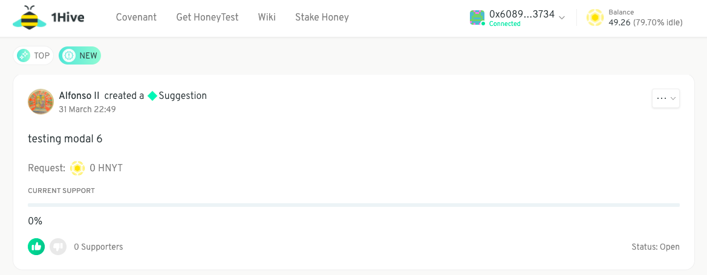
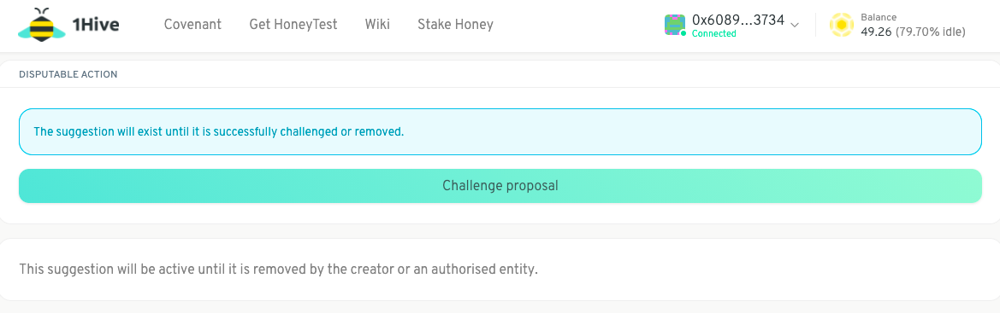
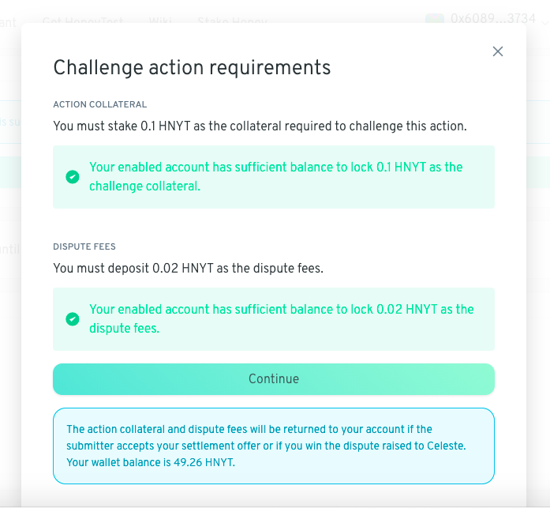

# Challenge a Proposal

1. Click on the proposal you'd like to challenge

2. Scroll down and click on _Challenge proposal_

3. Click _Continue_

4. Write your argument and Create transaction

5. View confirmation

