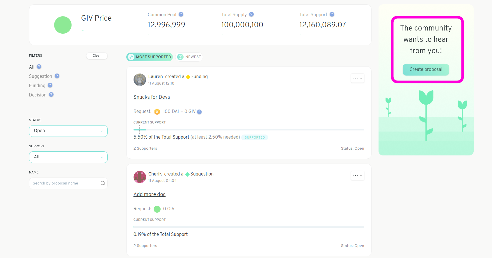
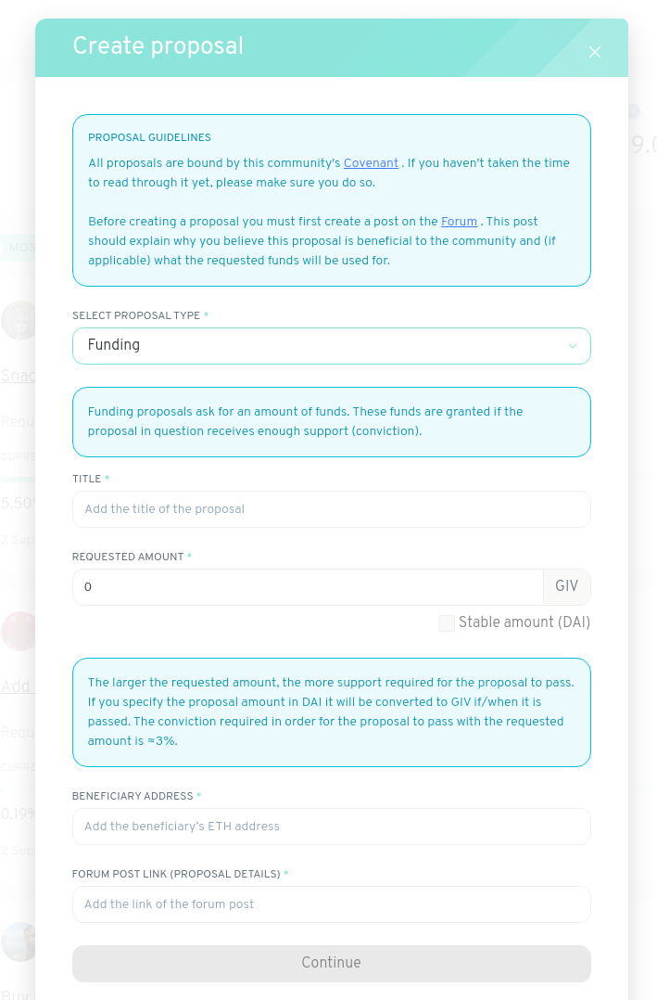

# Create a Proposal

Before you create a proposal make sure you [Sign the Covenant](signing-the-covenant.md) and [Deposit tokens](deposit-collateral.md) \(you won't be able to create a proposal without doing so\).

There are two types of proposals: _**Suggestion**_ and _**Funding**_. The proposal type _funding_ is used specifically for proposals that request tokens from the Common Pool.

Suggestions, which include things like the _abstain proposal,_ are proposals which do not request funds from the Common Pool. They can be used to draw collective attention to specific issues, without committing or requesting that funds be allocated to the issue in question.

Suggestions can accumulate support, but unlike Funding Proposals they are not made to pass. Instead, supporting a suggestion increases the amount of support required for any Funding Proposals to pass.

As such, a suggestion that makes the case for how you think the community should actually be allocating resources can have a meaningful impact on the behaviour of the system. Suggestions however can be challenged and escalated the same as Funding Proposals.

Once Funding Proposals have accrued enough support they can be executed by anyone. When executed, the requested type and amount of funds is transferred from the Common Pool to the beneficiary address.

The threshold and dynamics of support accumulation regulate how quickly tokens can be distributed from the Common Pool. You can read more about the distribution mechanism [here](https://wiki.1hive.org/projects/honey/distribution).

Proposals and Suggestions are the primary means of governance within a Garden, however, occasionally there is an unavoidable need to make a discrete decision. For example, upgrading smart contracts or adjusting the parameterization of a supply policy, or changing the voting settings of your Gardens.

In these instances a more traditional voting process is used, where a discrete action is proposed and voted on in a binary fashion. Votes are open for a fixed period of time, and if quorum and support threshold is reached the vote passes, and the action is executed.

