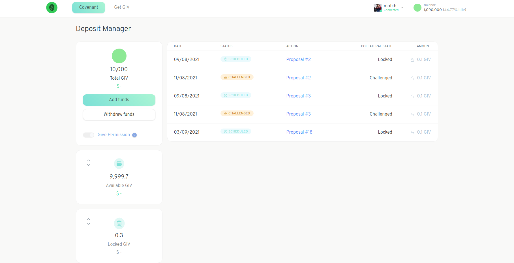

# Deposit Funds

Before you can create a proposal you are required to [Sign the Covenant](signing-the-covenant.md) and deposit some of your Garden's tokens. The deposit is used in the case that a dispute arises. 

A dispute occurs when another community member challenges your proposal because they believe it violates the Community's values.

**You will only forfeit your deposit if you lose the dispute** \(learn more about [dealing with challenged proposals](settle-a-proposal.md)\).

You can manage your deposited tokens in the Deposit Manager.

