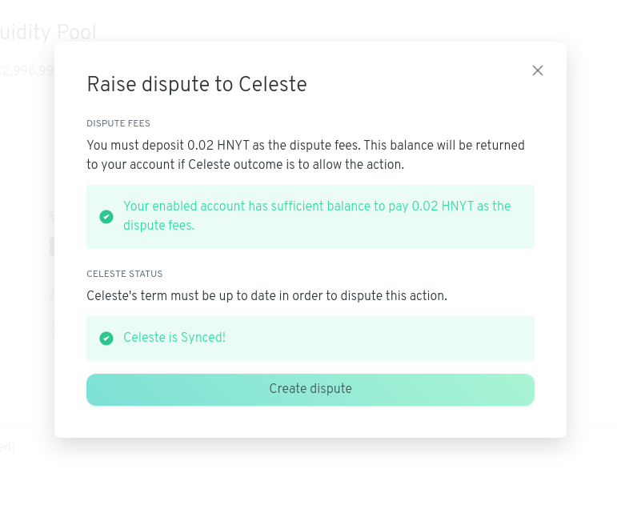
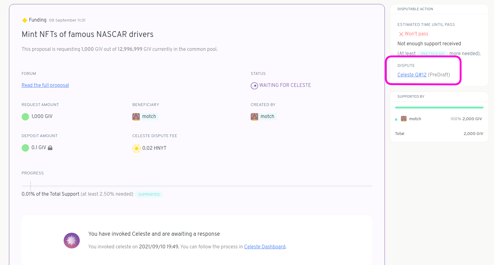
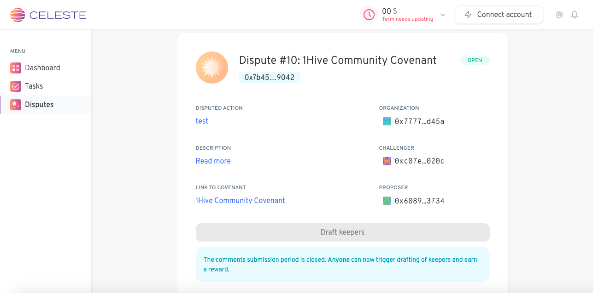
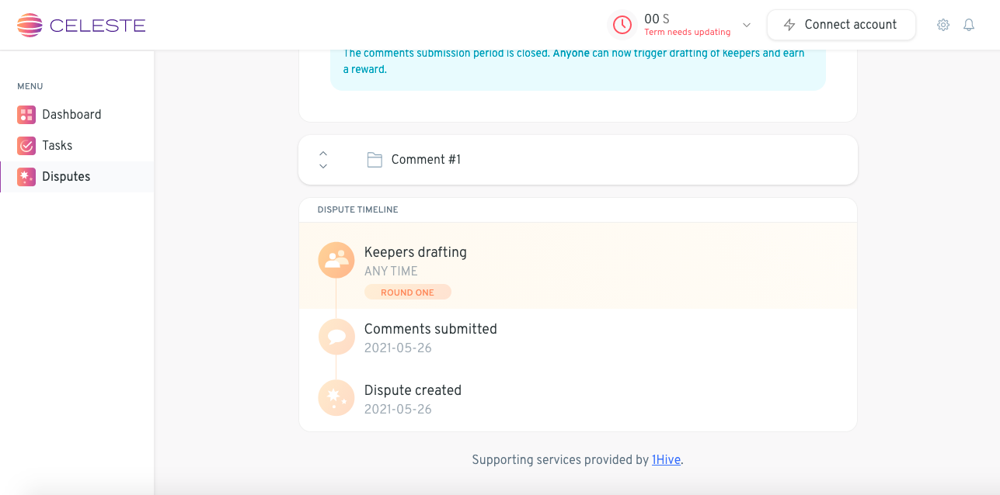

# Raise to Celeste

If you're proposal has been challenged you have two options, either [settle the dispute](settle-a-proposal.md) or raise it to Celeste. We will go over the process of raising a dispute to [Celeste](https://wiki.1hive.org/projects/celeste) in this article.

Looking at your challenged proposal on the right side click on `Raise to Celeste`.   

  
**Take note** that you have a limited amount of time to choose your course of action. The remaining time left can be found under `Settlement Period`.  If you don't take any action before the time runs out then part or all of your proposal deposit will be forfeit to the challenger.

You'll need to provide a bit of Honey \(HNY\) in order to pay the jurors who will rule over your challenged proposal, also known as a "Dispute". Make sure you have enough HNY in your wallet and the terms of Celeste are up to date. Proceed by clicking `Create Dispute` and sign the transactions.

You'll need to provide a little bit more collateral, but you'll get it back if Celeste rules in your favour.

To keep track of the dispute, click on the Celeste link in the Disputable Action box next to the proposal in question. This will take you to the Celeste platform.

You'll be directed to a page that looks like this:

Scroll down to keep track of the status of your dispute.

The dispute is now out of your hands. Celeste will draft a decentralized group of Keepers who will decide on whether or not your proposal violates your community's covenant -- the initial ruling will take roughly 7 days.

> **Note:** If either party is unhappy with the initial ruling, they can choose to top up their deposit and raise the dispute to an even larger group of Keepers. To learn more about the lifecycle of a dispute, [see here](https://1hive.gitbook.io/celeste/keepers/dispute-lifecycle).

