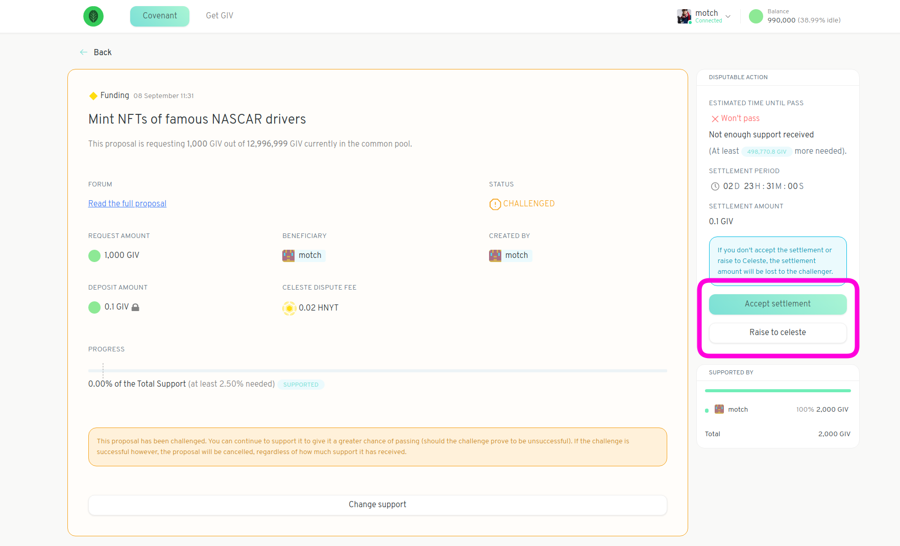
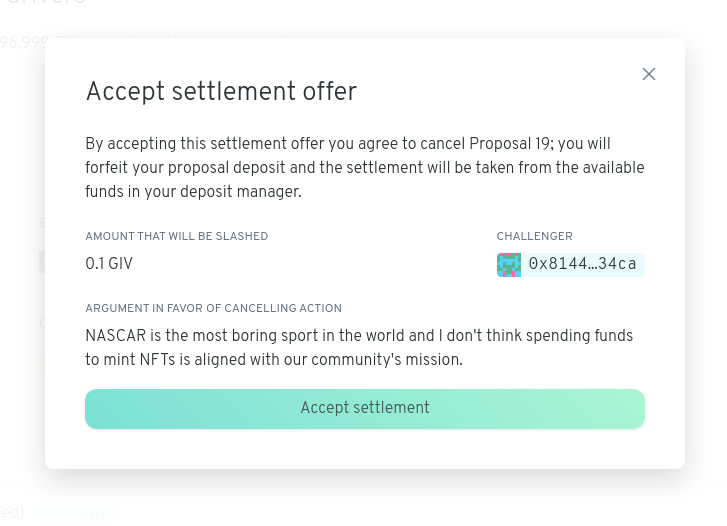

# Settle a Dispute

If a community member challenges a proposal you've made, you'll be able to see this in the Deposit Manager view -- the status of the proposal will be marked as `Challenged`.

Click on the proposal in question. You should see that you are able to either accept a settlement or raise the dispute to Celeste.  
  
**Take note** that you have a limited amount of time to choose your course of action. The remaining time left can be found under `SETTLEMENT PERIOD`.  If you don't take any action before the time runs out then part or all of your proposal deposit will be forfeit to the challenger. 

Click on _Accept settlement_ to view the challenger's argument

If you believe the challenger has a point -- in particular, if you believe your proposal violates your community's covenant -- you can accept the settlement. Accepting a settlement is akin to paying a small fee and withdrawing your proposal. The `AMOUNT THAT WILL BE SLASHED` is the fee you pay to the challenger and is also the amount forfeit if you don't respond to the challenge before the `SETTLEMENT PERIOD` ends.

The alternative is to raise the dispute to Celeste.

