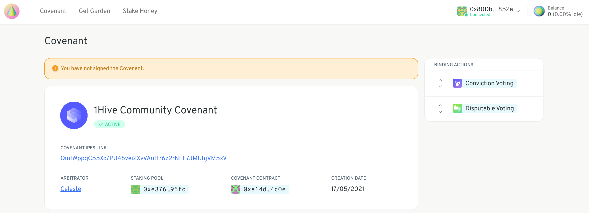
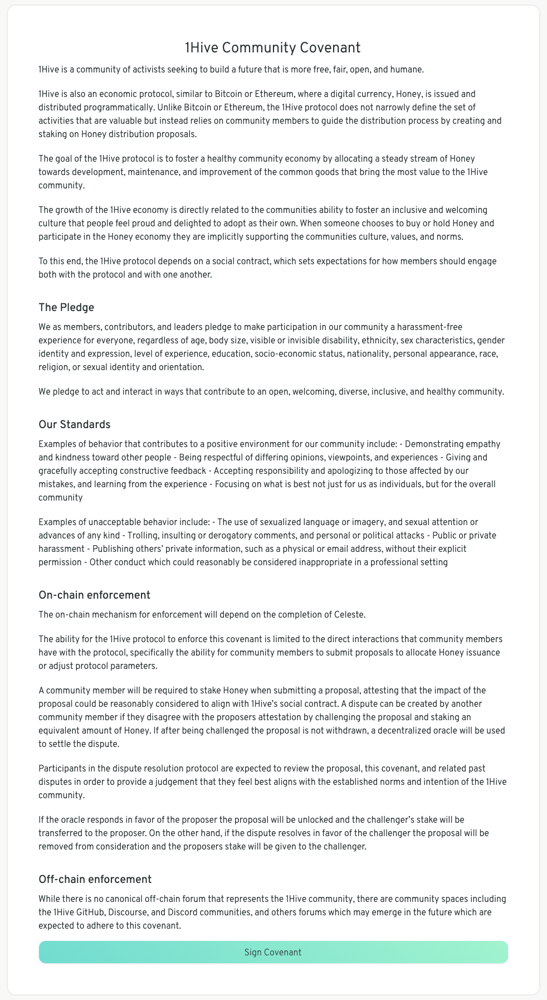

# Sign the Covenant

Anyone wanting to create a proposal has to sign their community's covenant. Any proposal which violates the spirit of the covenant can be challenged and disputed in [Celeste](https://1hive.gitbook.io/celeste/).

The details are specific to each Garden. They include the IPFS hash of the content, and the binding actions that signing it will allow.

Take your time to review the content of the covenant. These involve the rules, mission, and values of your community. It will be enforced by [Celeste](https://wiki.1hive.org/projects/celeste) if a dispute arises.

Once you are ready proceed to sign the covenant and follow the instructions.

Congratulations! You've taken an oath and bonded yourself to the values of your community [💫](https://hotemoji.com/dizzy-symbol-emoji.html)

