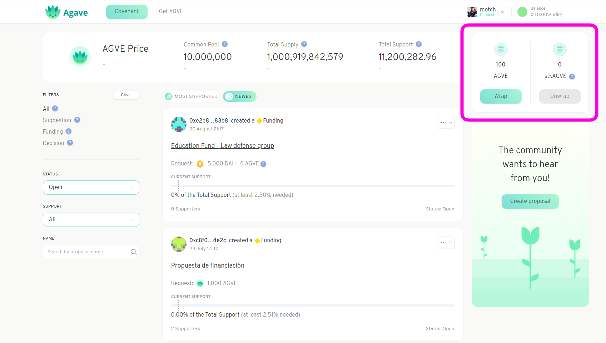
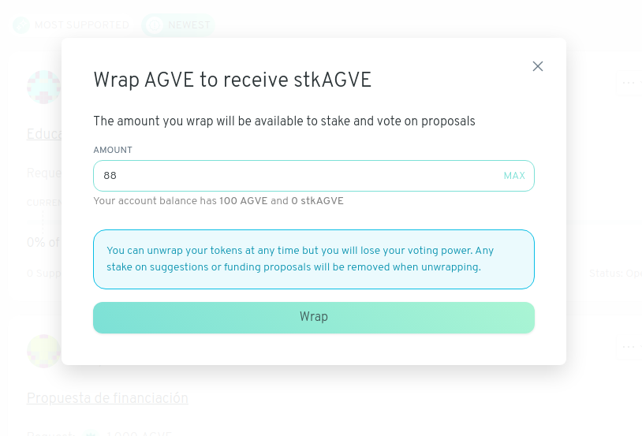

# Wrap your Tokens

> Note this page only applies to [Boboli](../../garden-creators/garden-modes.md#bring-your-own-token-byot) Gardens.

In order to gain voting power over the shared resources, members of the community need to wrap their tokens.

After connecting your account, the Wrap & Unwrap components will be shown.

Click the **Wrap** button and choose the amount of tokens you want to wrap.

After that you'll need to sign two transactions, one to allow the Garden to use your tokens and another to perform the token wrapping. Once the transactions are signed you are ready to use your wrapped tokens to support existing proposals. 🎉

