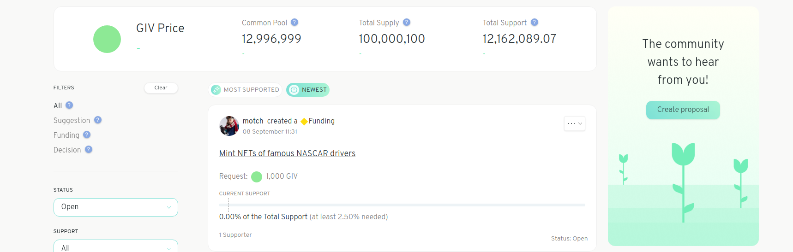
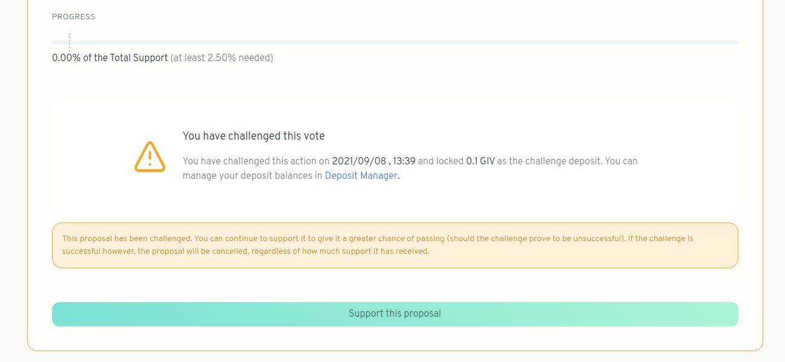

# Challenge a Proposal

If you see a proposal that you think is not aligned with the values outlined in your community's covenant, you can challenge the proposal. Challenging a funding proposal effectively blocks it from being executed until the challenge is resolved.

Anyone can challenge a proposal if they have deposited enough tokens \(usually a small amount\) and submitted enough Honey \(HNY\) from their wallet to cover any initial dispute fees. To challenge a proposal, follow these steps:

1. Click on the proposal you'd like to challenge.

1. On the right side of the page, click on _Challenge proposal_.

1. If you have deposited enough funds and have enough HNY in your wallet to cover any dispute fees you should be able to proceed from here. If so, click _Continue_.

The **Challenge Desposit** is an amount of tokens set by whomever created your Gardens, it is required to stake some tokens as collateral to challenge a proposal. This amount is taken from the tokens you have already deposited using the Deposit Manager. Backing challenges with collateral helps to ensure they have some amount of seriousness behind them. The Challenge Deposit can be forfeit in the case of Keepers ruling against your challenge, if the proposal was raised to Celeste.

1. Choose the **Settlement Offer**, this is the amount of tokens you will receive in the case that the proposal creator accepts a settlement. The settlement amount cannot be higher than the proposal deposit. Write out your argument to elaborate on why you think this proposal should be taken down. Once all this is set hit `Create transaction`.

1. View confirmation of your challenge on the proposal's page.

