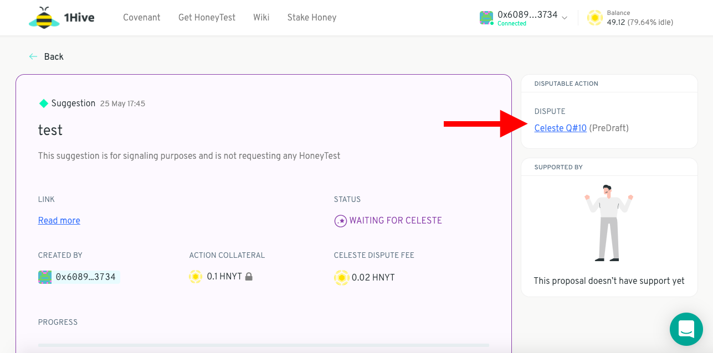
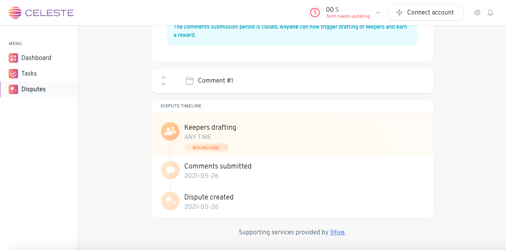

# Raise to Celeste

The alternative to [settling a dispute ](settle-a-proposal.md)is to raise the dispute to [Celeste](https://wiki.1hive.org/projects/celeste).

You'll need to provide a little bit more collateral, but you'll get it back if Celeste rules in your favour.

To keep track of the dispute, click on the Celeste link in the disputable action box next to the proposal in question.

You'll be directed to a page that looks like this

Scroll down to keep track of the status of your dispute

The dispute is now out of your hands. Celeste will draft a decentralised group of Keepers who will decide on whether or not your proposal violates your community's covenant -- the initial ruling will take roughly 7 days.

> **Note:** If either party is unhappy with the initial ruling, they can choose to stake some more collateral and raise the dispute to an even larger group of Keepers. To learn more about the lifecycle of a dispute, [see here](https://1hive.gitbook.io/celeste/keepers/dispute-lifecycle).

