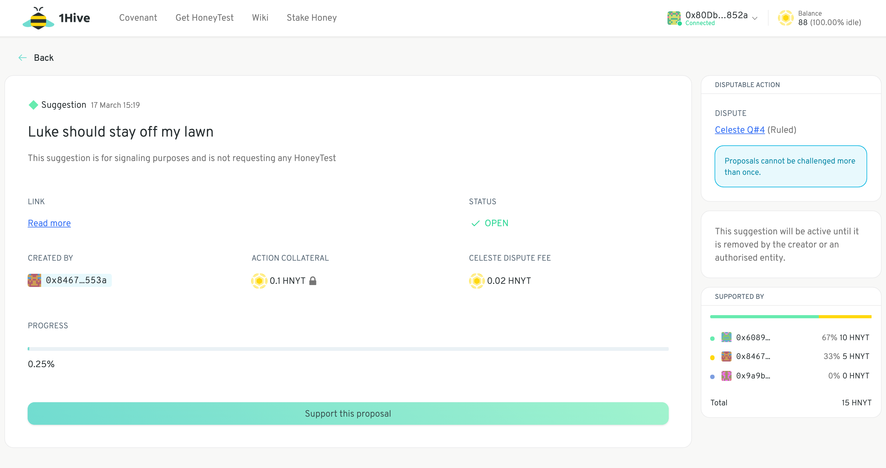

# Support a Proposal

 If you are a member of a [Pre-existing Token Garden](../garden-modes.md#pre-existing-token-gardens), please make sure you have [wrapped](wrap-your-tokens.md) a portion of your tokens. You won't be able to use unwrapped tokens to support proposals.

Supporting a proposal is equivalent to staking your token on that proposal. It provides a way to signal the strength of your conviction -- the more you stake, and the longer you stake it for, the greater the conviction. If and when enough conviction has accumulated the proposal will be executed.

Review the Proposal's attached link \(which should point to a relevant post in your community's forum\) to gain a better understanding of what is being proposed. 

### Conviction voting: finer details

Conviction Voting allows proposals to be created and considered continuously and simultaneously. Community members can signal their preferences for the proposals they support, but they are not able to “double count” their influence across multiple proposals. 

When they start supporting a proposal, the support \(called conviction\) does not immediately apply, but instead must charge up over time according to an exponential decay function or half-life.

For funding proposals, there is an execution threshold that is determined based on the proportion of funds requested relative to the funds available in the common pool. The greater the proportion, the greater the threshold required.

For a deeper dive on the conviction voting, check out this [cadCAD model](https://github.com/BlockScience/Aragon_Conviction_Voting) exploring the mechanism.

The conviction voting implementation  has been developed in collaboration with [Aragon](https://aragon.org/), [Commons Stack](https://commonsstack.org/), and [Block Science](https://block.science/) and is the main way in which the 1Hive community distributes its funds.

