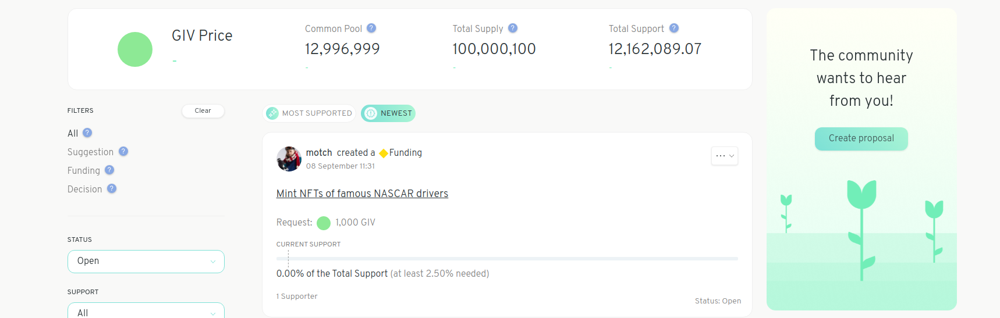
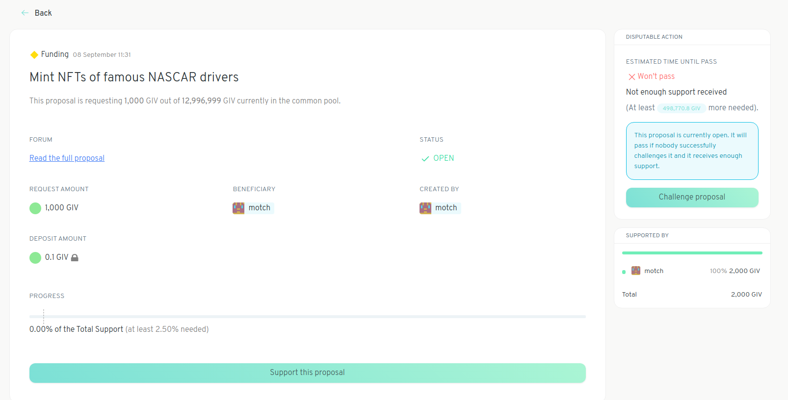
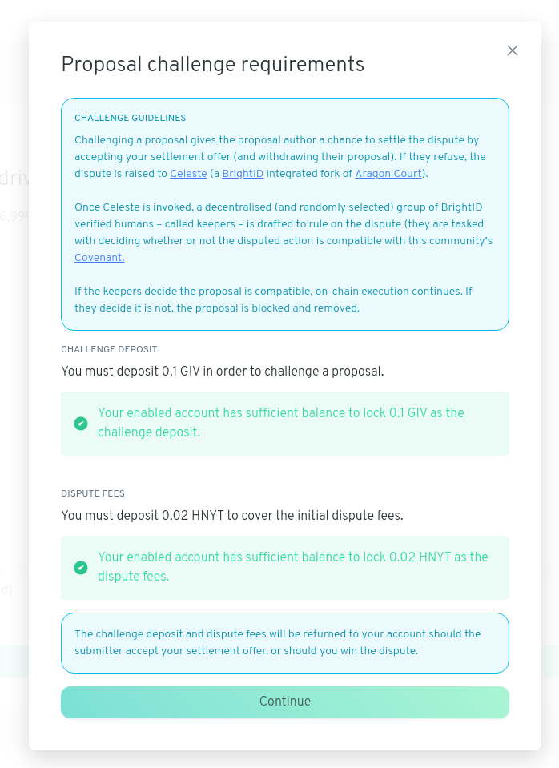
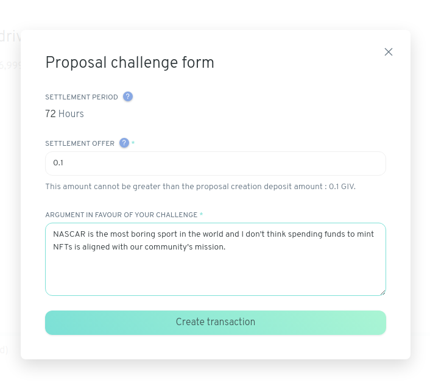
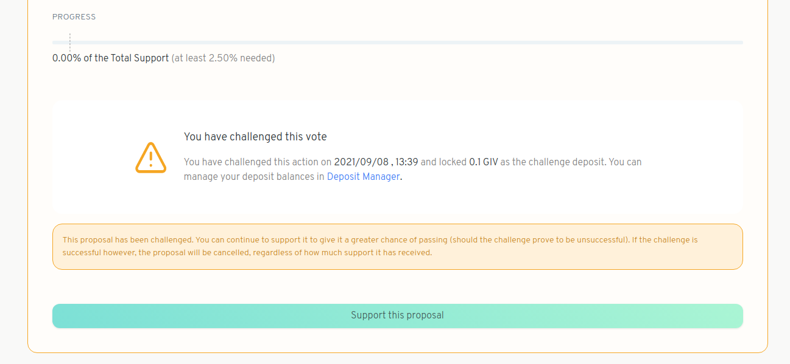

# Challenge a proposal

If you see a proposal that you think is not aligned with the values outlined by the community in their covenant, you can challenge the proposal. Challenging a proposal effectively blocks it from being executed until the challenge is resolved. Anyone can challenge a proposal in a Gardens if they have deposited enough collateral and submit enough Honey (HNY) from their wallet to cover any initial dispute fees. To challenge a proposal, follow these steps:

1. Click on the proposal you'd like to challenge.

2. On the right side of the page, click on _Challenge proposal_.

3. If you have deposited collateral and have enough HNY in your wallet to cover any dispute fees you should be able to proceed from here. If so, click _Continue_.

4. Choose the settlement amount, this is the amount of tokens you will receive in the case that the proposal creator accepts a settlement. The settlement amount cannot be higher than the original deposit collateral amount.  Write out your argument to elaborate on why you think this proposal should be taken down. Once all this is set hit `Create transaction`.

5. View confirmation of your challenge on the proposal's page.

