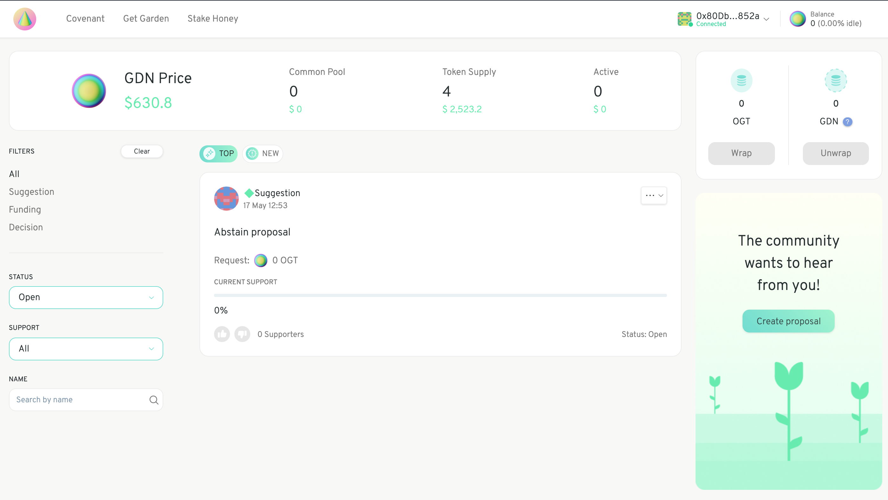
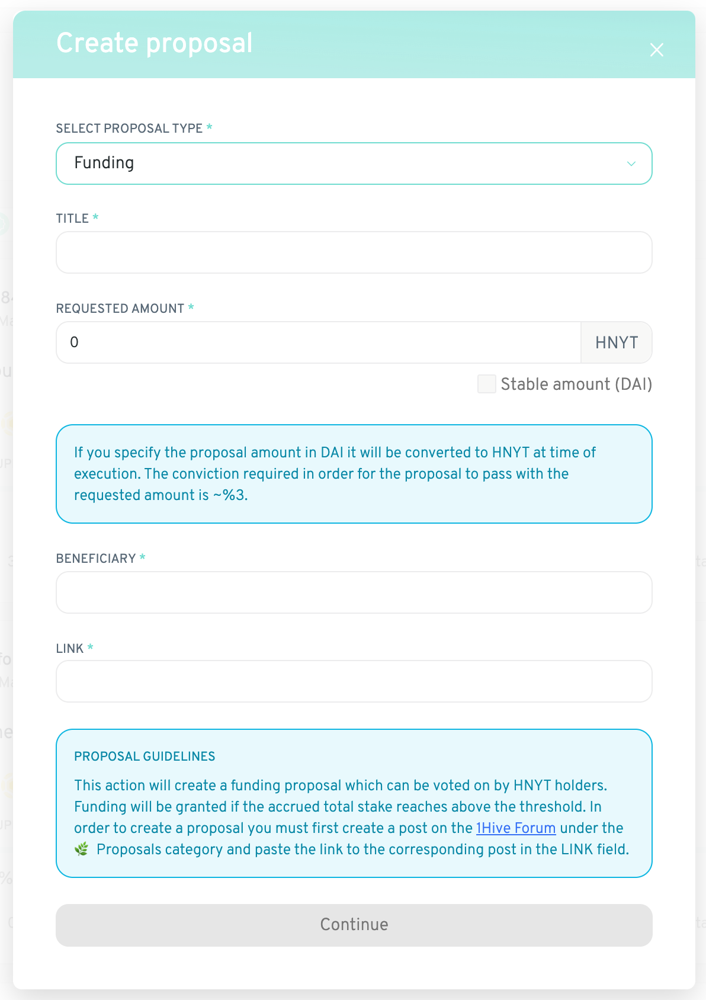

# Create a proposal

Before you create a proposal make sure you [Sign the Covenant](signing-the-covenant.md) and [Deposit collateral](deposit-collateral.md) \(you won't be able to create a proposal without doing so\).

There are two types of proposals: _suggestion_ and _funding_**. T**he proposal type _funding_ is used specifically for proposals that request tokens from the common pool.  

Suggestions, which include things like the _abstain proposal,_ are proposals which do not request funds from the common pool. They can be used to draw collective attention to specific issues, without committing or requesting that funds be allocated to the issue in question.

Suggestions can accumulate support, but they will never pass, so to speak. Instead, supporting a suggestion increases the amount of support required for all other distribution proposals to pass.

As such, a suggestion that makes the case for how you think the community should actually be allocating resources can have a meaningful influence on the behavior of the system.

Funding proposals have an activation threshold and can be executed by anyone once enough relative support has accumulated to that proposal. Once executed the requested amount of Honey is transferred from the common pool to the beneficiary address.

The threshold and dynamics of support accumulation regulate how quickly tokens can be distributed from the common pool. You can read more about the distribution mechanism [here](https://wiki.1hive.org/projects/honey/distribution).

Proposals and Suggestions are the primary means of governance within a Garden, however, occasionally there is an unavoidable need to make a discrete decision. For example, upgrading smart contracts or adjusting the parameterization of a supply policy.

In these instances a more traditional voting process is used, where a discrete action is proposed and voted on in a binary fashion. Votes are open for a fixed period of time, and if quorum and support threshold is reached the vote passes, and the action is executed.

