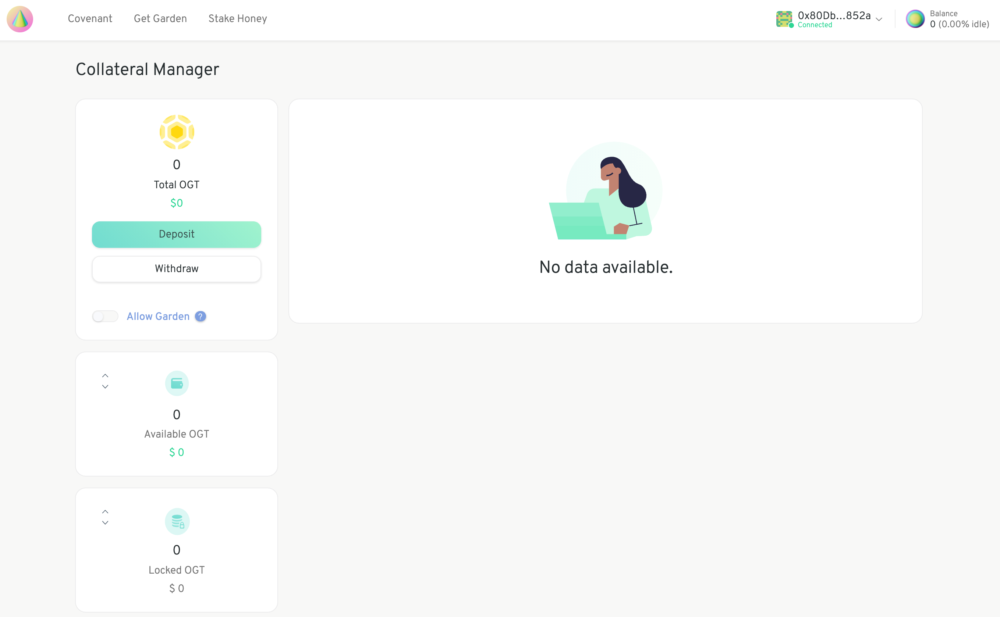

# Deposit some collateral

Before you can create a proposal you are required to [Sign the Covenant](signing-the-covenant.md) and deposit come collateral. The collateral is used in the case that a dispute arises -- in other words, if another community member disputes your proposal because they believe it violates the Community's values.  You will only forfeit your collateral if you lose the dispute.

You can manage your collateral balances in the Collateral Manager.

You need to deposit at least the minimum collateral requested to create a proposal. You will also be asked to allow the Garden to lock your balance when you vote.

