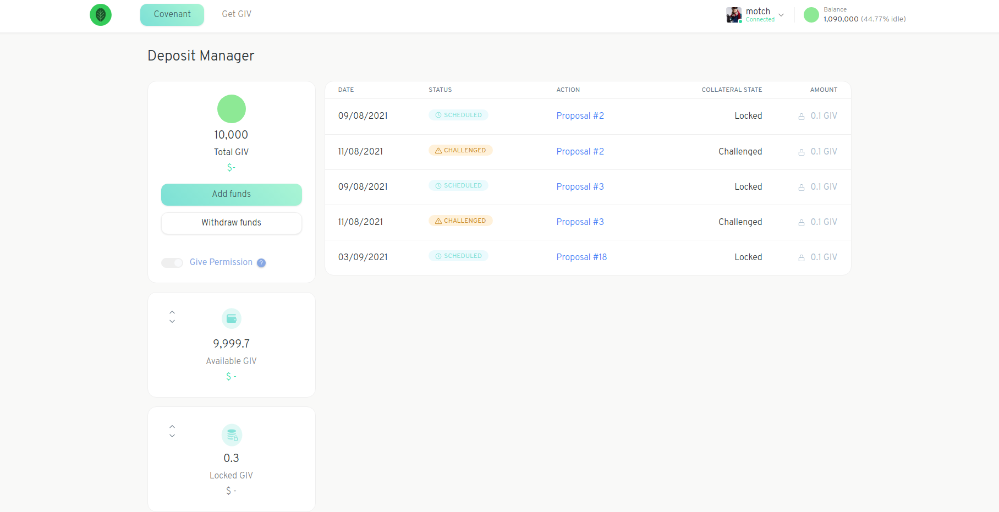

# Deposit Collateral

Before you can create a proposal you are required to [Sign the Covenant](signing-the-covenant.md) and deposit some of your Garden's tokens as collateral. The collateral is used in the case that a dispute arises. A dispute is when another community member challenges your proposal because they believe it violates the Community's values. You will only forfeit your collateral if you lose the dispute. Learn more about [dealing with challenged proposals](settle-a-proposal.md).

You can manage your deposited tokens in the Deposit Manager.

Every Garden has established a minimum amount of collateral that needs to be staked to create a proposal. You need to deposit at least the minimum collateral requested into your Garden to create a proposal. You will also be asked to allow the Garden to lock your balance when you vote.

From this screen you'll be able to see how much collateral you've deposited, and either add or withdraw tokens. You can also how many of your tokens are currently held as collateral on your proposals. On this screen as well you will see a detailed list of all your proposals.
