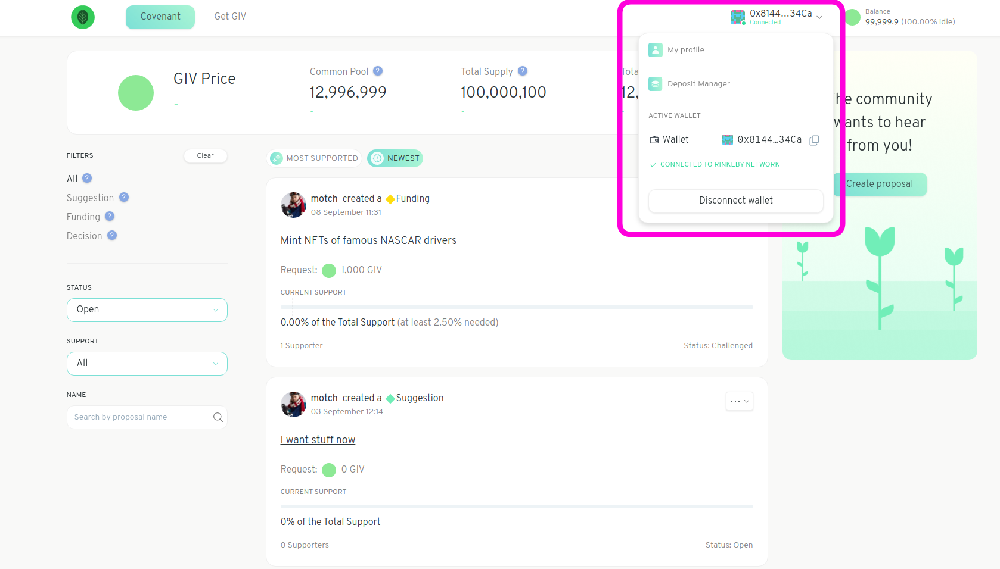
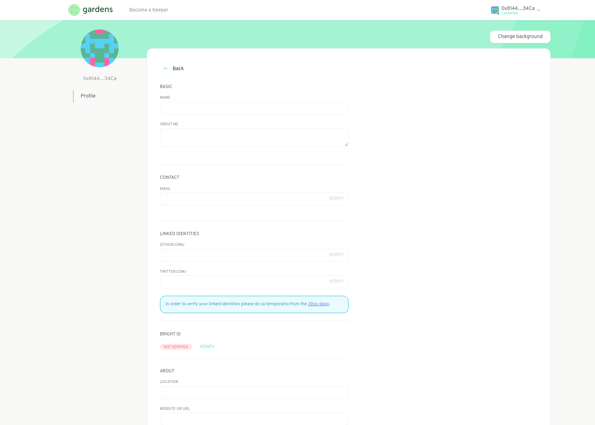

# Creating Your Account

If it's your first time entering the Gardens you should make a profile so your fellow community members will recognize who you are. Gardens uses 3box's IDX identity software to create your decentralized, digital identity which will be associated with your Ethereum address. Learn more about IDX on [their website](https://idx.xyz/).


When you create a digital identity with IDX this will become associated with your Ethereum address over all platforms and Ethereum Networks that implement IDX software. Be aware of how this may affect any DAOs or protocols you interact with.


To create your profile start by logging into Gardens with your Web3 wallet and click on your Ethereum address in the top right corner. Select `My Profile` from the drop down menu.

Once your into your profile page click `Edit Profile` and you can begin filling in information to identify yourself. Add in your name, a bit about yourself and your Twitter or Github handle if you choose. It is also strongly encouraged to leave an email address to notify you of any important events or actions required in your Garden.

You can also use [BrightID](https://www.brightid.org/) to verify your humanity. BrightID is a highly recommended tool to build trust across the Ethereum ecosystem.
