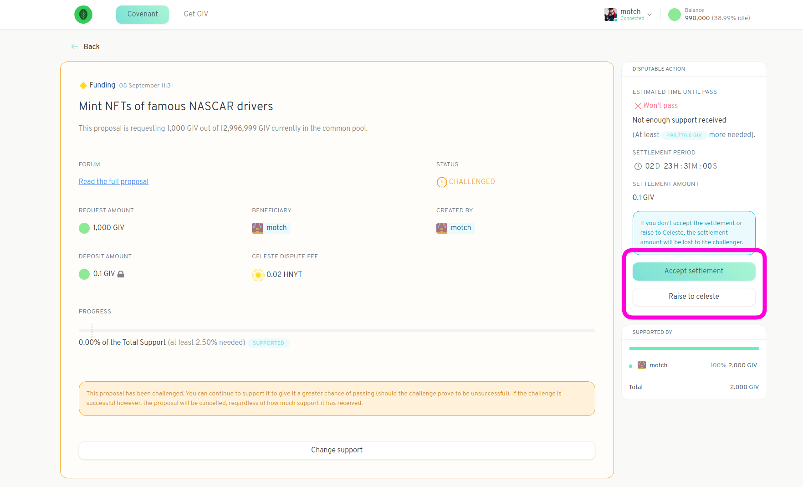
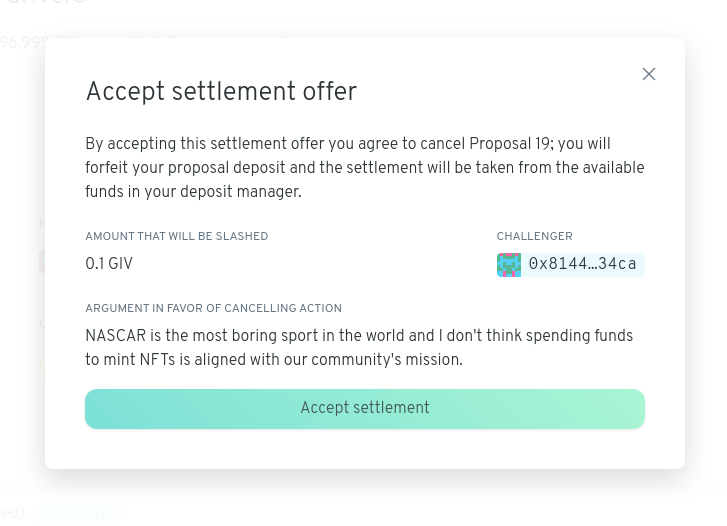

# Settle a dispute

If a community member challenges a proposal you've made, you'll be able to see this in the Deposit Manager view -- the status of the proposal will be marked as `CHALLENGED`.

Click on the proposal in question. You should see that you are able to either accept a settlement or raise the dispute to Celeste.

Click on _Accept settlement_ to view the challenger's argument

If you believe the challenger has a point -- in particular, if you believe your proposal violates your community's covenant -- you can accept the settlement. Accepting a settlement is akin to paying a small fee and withdrawing your proposal.

The alternative is to raise the dispute to Celeste.
