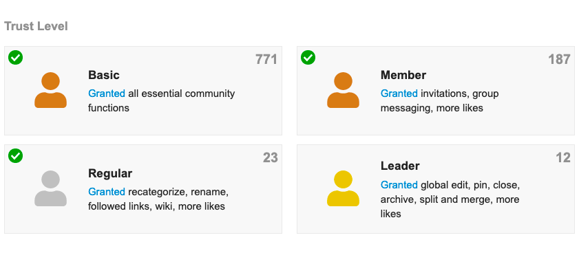

# Forum \(Discourse\)

[Discourse](https://www.discourse.org/) is quickly become the gold standard for more structured discussions amongst web3 communities \(see the [1hive forum](https://forum.1hive.org/) for an example\).

We expect communities to primarily used it as a discussion forum to share ideas and post/debate proposals.

## Trust levels

Discourse has four trust levels - basic, member, regular, and leader - which unlock progressively based on a community member's actions over time.

Note that Discourse [starts in “bootstrap mode”](https://meta.discourse.org/t/what-is-bootstrap-mode/58462) where the first 50 users who sign up are automatically granted TL1  to promote growth of the community via early adopters.

## Categories

Forum posts can be grouped by categories for easy searching.

Before creating a category, we recommend thinking through:

* Why should people use this category? What is it for?
* How exactly is this different than the other categories we already have?
* What should topics in this category generally contain?
* Do we need this category? Can we merge with another category, or subcategory?

## Place in the governance ecosystem

> TODO

## Recommended reading 

* [Set up your own discourse server](https://blog.discourse.org/2014/04/install-discourse-in-under-30-minutes/)
* [Understanding discourse trust levels](https://blog.discourse.org/2018/06/understanding-discourse-trust-levels/#:~:text=The%20user%20trust%20system%20is,levels%20are%20a%20way%20of%E2%80%A6&text=Granting%20experienced%20users%20more%20rights,much%20of%20their%20time%20to.)
* [Community building on the web](https://www.amazon.com/Community-Building-Web-Strategies-Communities/dp/0201874849)

